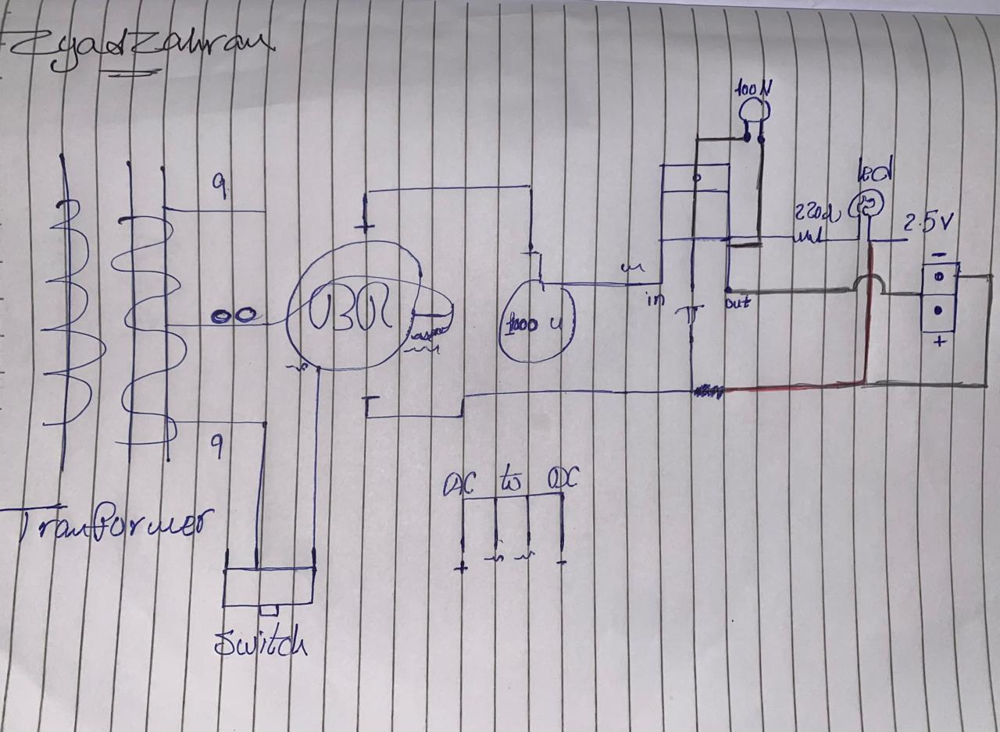

# DC Power Supply Circuit

A practical DC power supply circuit implemented on a breadboard.

## Project Overview

This project demonstrates the basic stages of converting AC power into a DC output.

## Main Stages

- Voltage transformation
- AC-to-DC rectification
- Voltage filtering
- Voltage regulation
- LED output indication

## Implementation

The circuit was assembled and tested on a breadboard. The LED indicator turned on successfully, showing that the circuit produced an output.

## Circuit Diagram

## Breadboard Implementation

## Working Circuit

## Skills Demonstrated

- Basic electronics
- Circuit implementation
- Breadboard prototyping
- Power supply fundamentals
- Circuit testing and troubleshooting
